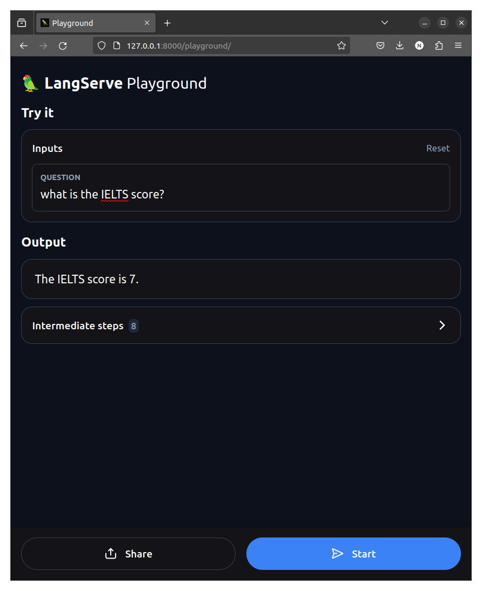
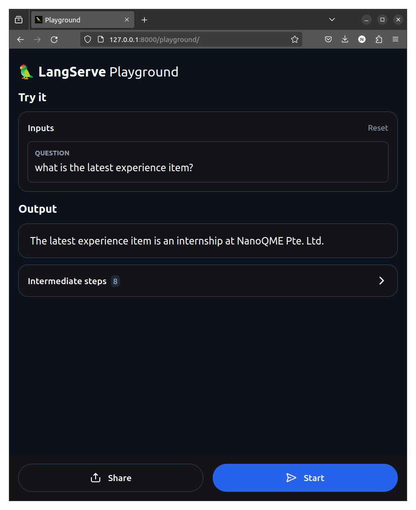
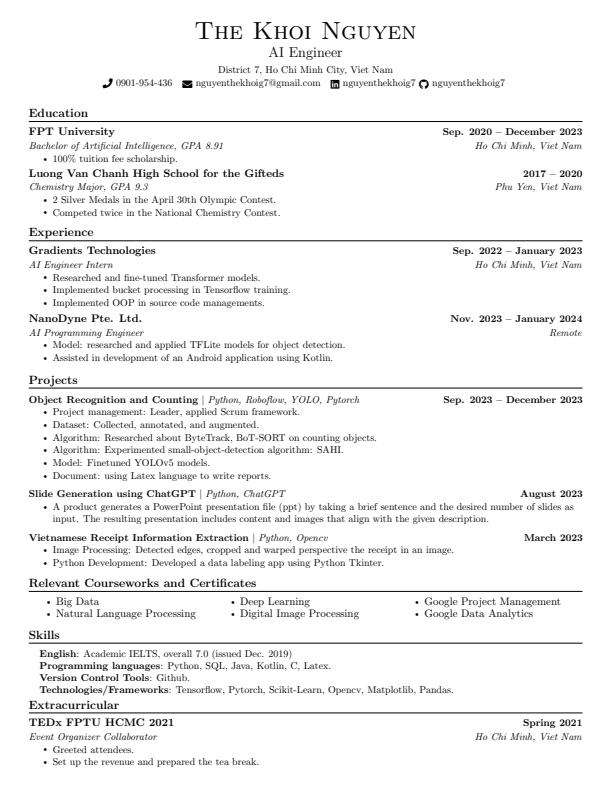

# chatbot-RAG-resume
Create a chatbot that know details of my resume, and answer questions about it.

### Under the hood
I start from a Langchain project template, which uses a OpenCLIP model to extract embeddings from image (my resume), then save the embeddings to Chroma database.

The Gemini model will be able to answer questions related to my resume, with the knowledge loaded from the Chroma database, represented as embedding, showcasing Retrieval-Augmented Generation ability.

### Demo
Some questions:
Question 1 | Question 2
:-------------------------:|:-------------------------:
  |  

For reference, here is my resume:

